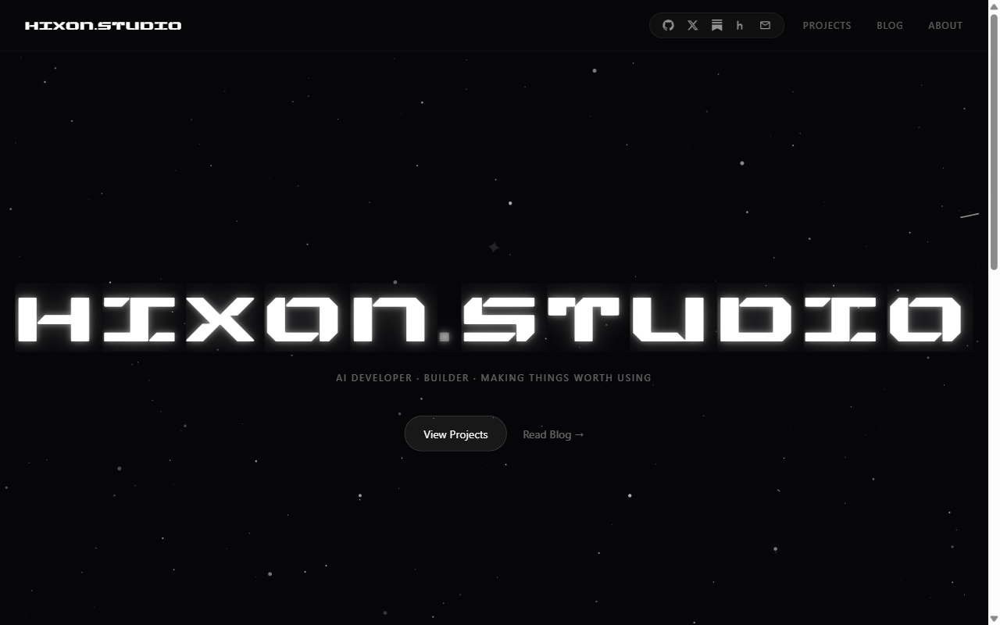

# hixon.studio

> Personal site, projects, and notes.

**Live:** [hixon.studio](https://hixon.studio)



The home for everything I build. Portfolio, project log, blog, and the place I send people when they ask "what are you working on?"

## Pages

- `/` — landing
- `/projects` — everything I've shipped, with write-ups
- `/blog` — notes and essays, written in MDX
- `/about` — who I am
- `/contact` — form that actually reaches me (Resend)
- `/harness` — local coding + language agents (Ollama, this machine only)

## Built with

- **Next.js 16** (App Router) + **TypeScript**
- **Tailwind CSS 4**
- **GSAP** for scroll + entrance animation
- **MDX** (`next-mdx-remote` + `gray-matter`) for blog content
- **Resend** for contact form email
- Custom typography: Fraunces, EB Garamond, Orbitron, Syncopate
- Deployed on **Vercel**

## Run locally

```bash
npm install
npm run dev     # http://localhost:3000
```

```bash
npm run build   # production build
npm test        # Jest + Testing Library
```

## Local agent harness

`/harness` is a studio desk for two local models. It talks to Ollama on this machine. Production Vercel will show the page, but the agents only run where Ollama is running.

**Machine this was tuned for:** HP Victus · AMD Ryzen 7 · RTX 4060 (usually 8 GB VRAM) · 144 Hz.

Run **one model at a time**. The harness unloads the other agent before a chat.

```bash
# Ollama 0.30+ is required for Qwen 3.5
ollama pull qwen2.5-coder:7b-instruct
ollama pull qwen3.5:9b
npm run dev     # then open /harness
```

| Agent | Model | Job |
| --- | --- | --- |
| Coder | Qwen 2.5 Coder 7B Instruct · Q4 | code, diffs, repairs |
| Language | Qwen 3.5 9B · Q4 | writing, planning, talk |

Optional: `OLLAMA_HOST=http://127.0.0.1:11434` if your runtime is not on the default port.
